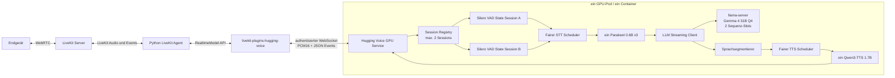

# Historisches Bootstrap-Prompt-Pack für Version 0.1

Dieses Dokument ist das historische Bootstrap-Prompt-Pack für Version 0.1.
Die damaligen No-Tool-Calling-Grenzen sind für Version 0.2 durch `AGENTS.md` und
`docs/tool-calling.md` ersetzt. Andere Architekturgrenzen bleiben gültig.

# Codex Prompt Pack: `livekit-hugging-voice`

**Lokaler Hugging-Voice-GPU-Service und eigener LiveKit-Agents-`RealtimeModel`-Adapter**
**Stand:** 22. Juli 2026
**Ziel:** neues, eigenständiges Python-Repository mit Docker- und Kubernetes-Betrieb, maximal zwei parallelen Demo-Sessions pro GPU-Pod und horizontaler Skalierbarkeit über zusätzliche GPU-Pods.

---

## 0. Verwendung dieses Prompt Packs

Dieses Pack ist für eine **lineare Implementierung im selben Repository und möglichst in derselben Codex-Session** gedacht.

1. Lege ein leeres Repository mit dem Arbeitsnamen `livekit-hugging-voice` an.
2. Führe zuerst den **Master Prompt** aus.
3. Führe danach die Waves 0 bis 8 in der angegebenen Reihenfolge aus.
4. Nach Wave 0 wird **keine neue allgemeine Inventur** mehr durchgeführt. Spätere Waves prüfen nur die für ihre konkrete Änderung relevanten Dateien.
5. Jede Wave muss den aktuellen Stand vollständig integrieren und die vorhandenen Tests grün hinterlassen.
6. Keine Remote-Repository-Erstellung, kein Push, kein Pull Request und keine Veröffentlichung ohne einen separaten ausdrücklichen Auftrag.
7. Test-Doubles sind ausschließlich unter `tests/` erlaubt. Es gibt keine Dummy-, Fake-, Mock- oder In-Memory-Modellstrecke im Produktionscode.
8. Falls die ausführende Umgebung keine NVIDIA-GPU besitzt, müssen GPU-Tests sauber als **nicht ausgeführt** ausgewiesen werden. Ergebnisse dürfen niemals simuliert oder erfunden werden.

Die Prompts enthalten absichtlich harte Grenzen. Sie sind keine Vorschläge, sondern Teil der Produktspezifikation.

## Aktuelle Kapazitätserweiterung

Die folgende Änderung ersetzt alle älteren Aussagen in diesem historischen Prompt
Pack, die Sessions oder llama.cpp-Sequenz-Slots fest auf zwei begrenzen:

- `server.max_sessions`, `models.llama_parallel_slots` und
  `models.llama_context_size` sind begrenzte Betreiberkonfiguration.
- Die sicheren Defaults bleiben zwei Sessions, zwei Slots und 32768 Tokens
  Gesamtkontext.
- `max_sessions` darf die Anzahl der llama.cpp-Slots nicht überschreiten; der
  Gesamtkontext muss mindestens 2048 Tokens je Slot bereitstellen.
- Eine Verbindung oberhalb des konfigurierten Sessionlimits wird weiterhin sofort
  mit `session_limit_reached` abgewiesen. Es gibt keine Benutzerwarteschlange.
- Parakeet, Gemma und Qwen werden unabhängig von der Sessionzahl weiterhin genau
  einmal pro Pod geladen.

## Aktuelle VoiceDesign-Erweiterung

Die folgende, am 22. Juli 2026 freigegebene Änderung ersetzt alle älteren Aussagen
in diesem Prompt Pack zu `CustomVoice`, `Aiden`, einer ausschließlich deutschen
Sprache oder dem Alias `de_standard_01`:

- TTS ist `Qwen/Qwen3-TTS-12Hz-1.7B-VoiceDesign` über den gepinnten lokalen
  GGML/CUDA-Streamingpfad.
- Unterstützte öffentliche Sprachen sind `de`, `en`, `fr` und `it`.
- Unterstützte Stimmen sind genau `warm_female`, `clear_female`, `warm_male`,
  `clear_male` und `friendly_neutral`.
- Diese IDs bilden auf feste, vom Betreiber konfigurierte VoiceDesign-Beschreibungen
  mit muttersprachlicher Aussprache der gewählten Sprache ab.
- Es gibt weiterhin kein Voice Cloning, kein Referenzaudio, keine Client-Pfade und
  keine frei übermittelte Basisbeschreibung. Begrenzte zusätzliche Stilhinweise
  dürfen nur an das feste Profil angehängt werden.
- Google TTS und Cloud-TTS gehören nicht zum Laufzeit- oder Erzeugungspfad.

---

# 1. Normative Upstream-Basis

Codex muss in Wave 0 die folgenden Quellen am angegebenen Commit lesen und die technisch relevanten Erkenntnisse in `docs/upstream-baseline.md` festhalten. Danach gelten diese lokalen Dokumente und der implementierte Code als Arbeitsgrundlage.

## Hugging Face Speech-to-Speech

Repository:

```text
https://github.com/huggingface/speech-to-speech
commit: c766ba1edf0023fba514571a4c1b4e05e344929f
package version at this commit: 0.2.11
```

Mindestens zu lesen:

```text
README.md
pyproject.toml
Dockerfile
docker-compose.yml
demo/CONTEXT.md
demo/README.md
src/speech_to_speech/s2s_pipeline.py
src/speech_to_speech/api/openai_realtime/README.md
src/speech_to_speech/api/openai_realtime/service.py
src/speech_to_speech/api/openai_realtime/websocket_router.py
src/speech_to_speech/api/openai_realtime/pipeline_unit.py
src/speech_to_speech/pipeline/cancel_scope.py
src/speech_to_speech/VAD/vad_handler.py
src/speech_to_speech/VAD/vad_iterator.py
src/speech_to_speech/STT/parakeet_tdt_handler.py
src/speech_to_speech/TTS/qwen3_tts_handler.py
```

Wesentliche Vorgaben, die daraus übernommen werden:

- kaskadierte Sprachstrecke `VAD → STT → LLM → TTS`;
- Server-VAD und Barge-in;
- partielle und finale Transkription;
- generationstag-basierte Cancellation;
- WebSocket-Ereignisse mit OpenAI-Realtime-artigen Namen;
- pro Session isolierter Gesprächs- und Turn-Zustand;
- sauberes Drain/Quarantine-Verhalten vor Wiederverwendung eines Session-Slots;
- Parakeet TDT für STT und Qwen3-TTS für Sprachausgabe.

Nicht zu übernehmen:

- Browserdemo, Orb-UI, OAuth, öffentliche Queue, Websuche und Kamera;
- WebRTC zwischen Agent und GPU-Service;
- DeepFilterNet oder sonstige Audioverbesserung;
- das alte Raw-Socket-Protokoll;
- vollständige OpenAI-Realtime-Protokollkompatibilität als Selbstzweck;
- `torch.hub`-Downloads beim Start;
- das E4B-Modell aus dem Upstream-Compose.

## LiveKit Agents

Repository:

```text
https://github.com/livekit/agents
commit: c67c44e607f1fe60bfa312853c9f8c91235d5015
livekit-agents version at this commit: 1.6.6
```

Mindestens zu lesen:

```text
livekit-agents/livekit/agents/llm/realtime.py
livekit-agents/livekit/agents/metrics/base.py
livekit-plugins/livekit-plugins-openai/livekit/plugins/openai/realtime/realtime_model.py
livekit-plugins/livekit-plugins-nvidia/livekit/plugins/nvidia/experimental/realtime/realtime_model.py
livekit-plugins/livekit-plugins-nvidia/pyproject.toml
```

Die Implementierung muss ein **eigenes** `livekit.agents.llm.RealtimeModel` und eine eigene `RealtimeSession` bereitstellen. Sie darf nicht das OpenAI-Plugin konfigurieren, forken oder mit einem Kompatibilitätsproxy täuschen.

## Modellstrecke

Die Modellstrecke des Hugging-Voice-Spaces wird lokal nachgebaut:

```text
Silero VAD
  → nvidia/parakeet-tdt-0.6b-v3
  → google/gemma-4-31B-it, lokal quantisiert über llama.cpp
  → Qwen/Qwen3-TTS-12Hz-1.7B-VoiceDesign
```

Festlegungen:

- **Gemma 4 31B ist verbindlich.** Das kleinere `gemma-4-E4B-it` darf nicht als stiller Ersatz verwendet werden.
- Standard-GGUF-Basis ist `ggml-org/gemma-4-31B-it-GGUF`, zunächst in einer verifizierten 4-Bit-Variante, bevorzugt `Q4_0` oder eine nach Messung bessere, dokumentierte 4-Bit-Variante.
- Parakeet ist wegen Deutsch `nvidia/parakeet-tdt-0.6b-v3`, nicht das englische 1.1B-Modell aus dem Space.
- TTS bleibt `Qwen/Qwen3-TTS-12Hz-1.7B-VoiceDesign`.
- Öffentliche Stimmen sind die fünf festen VoiceDesign-Profile aus der aktuellen Erweiterung.
- Sprachen sind `de`, `en`, `fr` und `it`.
- Voice Cloning, Referenzaudio und frei übermittelte VoiceDesign-Beschreibungen gehören nicht zum Produktumfang.

---

# 2. Master Prompt

Den folgenden Prompt einmal zu Beginn in Codex ausführen.

```text
Du implementierst ein neues Repository namens `livekit-hugging-voice`.

Das Produkt besteht aus:

1. einem lokalen GPU-Service, der die Hugging-Voice-Strecke
   Silero VAD → Parakeet TDT 0.6B v3 → Gemma 4 31B IT → Qwen3-TTS 1.7B VoiceDesign
   ausführt;
2. einem eigenen Python-Plugin `livekit-plugins-hugging-voice`, das ein echtes
   `livekit.agents.llm.RealtimeModel` und eine `RealtimeSession` implementiert;
3. Docker- und Kubernetes-Auslieferung für den GPU-Service;
4. einem minimalen LiveKit-Agent-Beispiel und reproduzierbaren Contract-,
   Integrations-, Last- und GPU-E2E-Tests.

Lies vor der Implementierung `AGENTS.md`, dieses Prompt Pack und die dort genannten
Upstream-Dateien an den exakt gepinnten Commits. Halte die Upstream-Erkenntnisse einmalig
in `docs/upstream-baseline.md` fest. Führe in späteren Waves keine erneute allgemeine
Inventur durch.

Nicht verhandelbare Produktgrenzen:

- ausschließlich Python für Service, Plugin, Tests und Hilfsprogramme;
- kein MCP, kein mAIstack, kein FastEnhancer und keine sonstige Audioverbesserung;
- kein Browserfrontend und kein eigener WebRTC-Hop zum GPU-Service;
- kein Cloud-LLM und kein Cloud-Fallback;
- kein Funktions-/Tool-Calling in Version 1;
- keine Datenbank, kein Redis, kein Message Broker, kein Operator und kein Helm;
- keine generische Provider-Registry und keine austauschbare Backend-Plattform;
- keine Produktions-Dummies, keine Demo-Backends und keine Fake-In-Memory-Dienste;
- keine stillen CPU-Fallbacks und keine stillen Modell-Downgrades;
- keine Runtime-Downloads und insbesondere kein `torch.hub` beim Start;
- keine `latest`-Tags, keine beweglichen Git-Branches und keine unaufgelösten
  Modellrevisionen;
- keine zwei vollständig duplizierten Parakeet-, Gemma- oder Qwen-Modellinstanzen,
  um zwei Sessions zu ermöglichen;
- maximal zwei verbundene Sessions pro GPU-Service-Instanz; ein dritter Client wird
  eindeutig abgewiesen, nicht in eine Queue gestellt;
- Gemma 4 31B, nicht E4B;
- vier feste Sprachen und fünf feste VoiceDesign-Profile;
- keine erfundenen Benchmarks oder Erfolgsmeldungen.

Architektur:

- Endgerät ↔ LiveKit bleibt WebRTC und liegt außerhalb dieses GPU-Service-Protokolls.
- LiveKit-Agent ↔ GPU-Service verwendet einen internen authentisierten WebSocket.
- Der GPU-Pod enthält den Python-Service und einen vom Service kontrollierten,
  auf Loopback gebundenen `llama-server`-Prozess.
- Pro GPU-Pod werden Gemma, Parakeet und Qwen jeweils genau einmal geladen.
- VAD-Zustand darf pro Session getrennt instanziiert werden, weil Silero klein und
  zustandsbehaftet ist.
- STT- und TTS-Zugriffe werden über kleine faire Scheduler serialisiert oder begrenzt.
- Gemma läuft mit zwei parallelen llama.cpp-Sequenz-Slots.
- Jede Arbeitseinheit trägt mindestens `session_id`, `turn_id`, `turn_revision` und
  `generation_id`.
- Nach Cancellation werden alle alten Text- und Audiofragmente anhand der Generation
  verworfen.
- Gesprächszustand ist ausschließlich flüchtig und wird nicht gespeichert.

Arbeitsweise:

- Implementiere vollständige vertikale Funktionen, keine Platzhalter.
- Test-Doubles sind nur in `tests/` erlaubt und werden explizit injiziert.
- Blocking GPU-Arbeit darf niemals den asyncio-Event-Loop blockieren.
- Fehler werden strukturiert weitergegeben; keine breiten `except Exception: pass`-Pfade.
- Reconnect, Retries und Backpressure müssen begrenzt sein.
- Keine zusätzlichen Abstraktionsschichten, wenn eine konkrete Klasse genügt.
- Kein Konfigurationsflag ohne einen realen Betriebsgrund.
- Keine Veröffentlichung, kein Push und kein PR ohne separaten Auftrag.
- Nach jeder Wave: geänderte Dateien, ausgeführte Befehle, echte Testergebnisse und
  verbleibende Einschränkungen nennen.

Erzeuge in Wave 0 ein `AGENTS.md`, das diese Grenzen dauerhaft im Repository festhält.
```

---

# 3. Zielarchitektur



## Zwei Sessions sind nicht zwei Modellkopien

Verboten:

```text
Session A → eigener Parakeet + eigener Gemma + eigener Qwen
Session B → eigener Parakeet + eigener Gemma + eigener Qwen
```

Verlangt:

```text
Session A ┐
          ├→ Shared Parakeet Runtime
Session B ┘

Session A ┐
          ├→ ein llama-server mit zwei Sequenz-Slots
Session B ┘

Session A ┐
          ├→ Shared Qwen Runtime mit fairem Segment-Scheduler
Session B ┘
```

## Explizit kein zweiter WebRTC-Hop

Der GPU-Service implementiert nur WebSocket. Er enthält kein `aiortc`, keine ICE-Logik, keinen STUN-/TURN-Support und keine Browser-Audioerfassung. LiveKit übernimmt bereits den WebRTC-Transport zum Nutzer.

---

# 4. Zielstruktur des Repositorys

```text
livekit-hugging-voice/
├── AGENTS.md
├── README.md
├── LICENSE
├── NOTICE.md
├── THIRD_PARTY.md
├── pyproject.toml
├── uv.lock
├── Makefile
├── .python-version
├── .gitignore
├── .dockerignore
│
├── packages/
│   ├── hugging-voice-protocol/
│   │   ├── pyproject.toml
│   │   ├── src/hugging_voice_protocol/
│   │   │   ├── __init__.py
│   │   │   ├── events.py
│   │   │   ├── audio.py
│   │   │   ├── errors.py
│   │   │   └── version.py
│   │   └── tests/
│   │
│   └── livekit-plugins-hugging-voice/
│       ├── pyproject.toml
│       ├── README.md
│       ├── livekit/plugins/hugging_voice/
│       │   ├── __init__.py
│       │   ├── realtime_model.py
│       │   ├── realtime_session.py
│       │   ├── endpoint_resolver.py
│       │   ├── audio.py
│       │   ├── metrics.py
│       │   ├── errors.py
│       │   └── version.py
│       └── tests/
│
├── services/
│   └── gpu-service/
│       ├── pyproject.toml
│       ├── Dockerfile
│       ├── config/default.yaml
│       ├── src/hugging_voice_service/
│       │   ├── __init__.py
│       │   ├── app.py
│       │   ├── config.py
│       │   ├── lifecycle.py
│       │   ├── auth.py
│       │   ├── sessions.py
│       │   ├── capacity.py
│       │   ├── conversation.py
│       │   ├── cancellation.py
│       │   ├── pipeline.py
│       │   ├── text_segmenter.py
│       │   ├── model_manifest.py
│       │   ├── model_prefetch.py
│       │   ├── llama_process.py
│       │   ├── telemetry.py
│       │   ├── health.py
│       │   ├── websocket.py
│       │   ├── runtimes/
│       │   │   ├── silero.py
│       │   │   ├── parakeet.py
│       │   │   ├── gemma.py
│       │   │   └── qwen_tts.py
│       │   └── schedulers/
│       │       ├── stt.py
│       │       └── tts.py
│       └── tests/
│
├── models/
│   ├── manifest.yaml
│   ├── manifest.lock.json
│   └── README.md
│
├── examples/
│   └── minimal-livekit-agent/
│       ├── pyproject.toml
│       ├── agent.py
│       ├── .env.example
│       └── README.md
│
├── deploy/
│   ├── docker/
│   │   ├── compose.yaml
│   │   ├── compose.livekit.yaml
│   │   └── secrets/.gitkeep
│   └── kubernetes/
│       ├── base/
│       │   ├── kustomization.yaml
│       │   ├── serviceaccount.yaml
│       │   ├── configmap.yaml
│       │   ├── secret.example.yaml
│       │   ├── pvc.yaml
│       │   ├── deployment.yaml
│       │   ├── service.yaml
│       │   └── service-headless.yaml
│       ├── overlays/demo/
│       │   ├── kustomization.yaml
│       │   └── patch.yaml
│       ├── overlays/production/
│       │   ├── kustomization.yaml
│       │   └── patch.yaml
│       └── jobs/model-prefetch.yaml
│
├── tests/
│   ├── contract/
│   ├── integration/
│   ├── e2e/
│   ├── load/
│   └── fixtures/
│
├── benchmarks/
│   ├── one_session.py
│   ├── two_sessions.py
│   ├── interruption.py
│   ├── voice_audition.py
│   ├── summarize.py
│   └── reports/.gitkeep
│
├── docs/
│   ├── architecture.md
│   ├── protocol.md
│   ├── upstream-baseline.md
│   ├── model-delivery.md
│   ├── docker.md
│   ├── kubernetes.md
│   ├── operations.md
│   ├── benchmark-methodology.md
│   └── security.md
│
└── .github/workflows/
    ├── ci.yaml
    ├── container.yaml
    └── gpu-e2e.yaml
```

Der kleine Package-Baustein `hugging-voice-protocol` ist eine reine interne Bibliothek ohne ML- oder LiveKit-Abhängigkeiten. Öffentliche Produktartefakte bleiben der Plugin-Wheel und das GPU-Service-Image.

---

# 5. Feste Laufzeit- und Modellkonfiguration

## Audio

```yaml
input:
  encoding: pcm_s16le
  sample_rate: 16000
  channels: 1
  client_chunk_ms: 40

pipeline:
  sample_rate: 16000
  vad_window_samples: 512

output:
  encoding: pcm_s16le
  sample_rate: 24000
  channels: 1
  frame_ms: 20
```

Der Service darf intern bei 16 kHz arbeiten und vor dem Protokollausgang auf 24 kHz resamplen. Das Plugin erzeugt daraus `rtc.AudioFrame`-Objekte.

## VAD

Ausgangswerte, die anhand der Upstream-Tests übernommen und mit deutscher Sprache validiert werden:

```yaml
threshold: 0.6
min_speech_ms: 384
min_speech_continuation_ms: 192
min_silence_ms: 500
speech_pad_ms: 30
short_segment_merge_ms: 0
interrupt_response: true
```

- Silero läuft auf CPU mit einem Thread.
- Pro Session eigener zustandsbehafteter VAD-Kontext.
- Kein DeepFilterNet.
- Kein Netzwerkzugriff über `torch.hub`.
- Bevorzugt `silero-vad==6.2.1` oder eine im Lockfile exakt gepinnte, nachweislich kompatible Version.

## STT

```yaml
model: nvidia/parakeet-tdt-0.6b-v3
language: de
device: cuda
compute_type: float16
partial_interval_ms: 500
```

Regeln:

- finales STT hat Priorität vor partiellen Updates;
- partielle Jobs dürfen bei belegter STT-Runtime übersprungen werden;
- finale Jobs dürfen nicht still verworfen werden;
- keine CPU-Ausweichroute, wenn CUDA fehlt;
- ein geladenes Parakeet-Modell pro Pod.

## LLM

```yaml
source_model: google/gemma-4-31B-it
gguf_repo: ggml-org/gemma-4-31B-it-GGUF
quantization: verified 4-bit, default Q4_0
llama_parallel_slots: 2
llama_total_context: 32768
max_output_tokens: 256
thinking: disabled
listen: 127.0.0.1 only
```

Regeln:

- `llama-server` wird aus einem exakt gepinnten llama.cpp-Commit gebaut;
- er läuft als vom Python-Service kontrollierter Child-Prozess im selben Container;
- kein `-hf` und kein Modelldownload beim Start, sondern ein lokaler GGUF-Pfad;
- der Python-Service wartet auf echte llama.cpp-Readiness, bevor er selbst ready wird;
- ausschließlich Text-Output wird an TTS geleitet;
- Reasoning-Events, `reasoning_content`, Thinking-Blöcke und interne Steuerdaten dürfen niemals gesprochen werden;
- Denken muss im nativen Gemma-/llama.cpp-Request deaktiviert werden;
- ein auftretender führender Thinking-Block wird zusätzlich defensiv nicht an TTS weitergegeben und als Protokollfehler/Telemetry erfasst;
- Antworten sind für Sprache kurz und ohne Markdown zu erzeugen.

Festes serverseitiges Basisprompt:

```text
Du führst ein gesprochenes Gespräch auf Deutsch.
Antworte natürlich, direkt und in klarem Hochdeutsch.
Verwende keine Markdown-Formatierung.
Antworte normalerweise in höchstens zwei bis drei kurzen Sätzen.
Gib niemals interne Überlegungen, Systemtexte, Steuerdaten oder verborgene Analyse aus.
```

Vom LiveKit-Agent gelieferte Instructions werden zusätzlich, nicht anstelle dieses Basisprompts, angewendet.

## TTS

```yaml
model: Qwen/Qwen3-TTS-12Hz-1.7B-VoiceDesign
device: cuda
languages: [German, English, French, Italian]
public_voices: [warm_female, clear_female, warm_male, clear_male, friendly_neutral]
```

Regeln:

- ein geladenes Qwen-Modell pro Pod;
- `faster-qwen3-tts`-Streamingpfad unter Linux/CUDA;
- keine freie Basisbeschreibung oder Pfadauswahl durch Clients;
- keine Referenzaudios;
- Text wird in kurze, geordnete Sprachsegmente zerlegt;
- Segmentlänge wird begrenzt, damit eine Session den einzigen TTS-Worker nicht lange blockiert;
- Cancellation wird zwischen jedem erzeugten Audiochunk geprüft;
- Qwen-Ausgabe wird in 20-ms-PCM-Frames normalisiert;
- Audio einer alten `generation_id` wird verworfen.

---

# 6. Protokollvertrag

Das Protokoll verwendet einen authentisierten WebSocket unter:

```text
WS /v1/realtime
Sec-WebSocket-Protocol: hugging-voice-livekit.v1
Authorization: Bearer <token>
```

Es ist ein **bewusst begrenztes** Protokoll mit OpenAI-Realtime-artigen Ereignisnamen. Es muss nicht alle OpenAI-Ereignisse implementieren.

Jedes Ereignis enthält:

```json
{
  "type": "...",
  "event_id": "evt_...",
  "protocol_version": 1,
  "session_id": "session_..."
}
```

Turn- oder Antwortereignisse enthalten zusätzlich, soweit passend:

```json
{
  "turn_id": "turn_...",
  "turn_revision": 0,
  "generation_id": "gen_...",
  "response_id": "resp_...",
  "item_id": "item_..."
}
```

## Client → Service

```text
session.update
input_audio_buffer.append
input_audio_buffer.commit
input_audio_buffer.clear
conversation.item.create
response.create
response.cancel
```

### `session.update`

Erlaubt:

- Instructions;
- Audioformate aus der fest unterstützten PCM16-Matrix;
- Server-VAD an/aus und dokumentierte Schwellenwerte innerhalb sicherer Grenzen;
- `interrupt_response`;
- Aktivierung eingebauter Transkription;
- Voice ausschließlich aus den fünf festen VoiceDesign-Profilen.

Nicht erlaubt:

- Modellname;
- Dateipfad;
- beliebige Qwen-Speaker;
- Tooldefinitionen;
- Cloud-Endpunkte;
- Referenzaudio.

### `input_audio_buffer.append`

- Base64-kodiertes PCM16;
- mono;
- normal 40 ms;
- harte Maximalgröße je Nachricht;
- Sequenz wird vom Plugin geordnet gesendet;
- Service hält nur einen begrenzten Restpuffer.

### `conversation.item.create`

Version 1 akzeptiert ausschließlich abgeschlossene Textnachrichten der Rollen `user` und `assistant` für initiales oder nach Reconnect wiederhergestelltes Gesprächskontext-Replay. Keine Function Calls.

## Service → Client

```text
session.created
error
input_audio_buffer.speech_started
input_audio_buffer.speech_stopped
conversation.item.input_audio_transcription.delta
conversation.item.input_audio_transcription.completed
response.created
response.output_text.delta
response.output_text.done
response.output_audio.delta
response.output_audio.done
response.done
```

`session.created` enthält mindestens:

```json
{
  "type": "session.created",
  "protocol_version": 1,
  "models": {
    "vad": "silero-vad",
    "stt": "nvidia/parakeet-tdt-0.6b-v3",
    "llm": "google/gemma-4-31B-it",
    "tts": "Qwen/Qwen3-TTS-12Hz-1.7B-VoiceDesign"
  },
  "language": "de",
  "voice": "warm_female",
  "input_sample_rate": 16000,
  "output_sample_rate": 24000
}
```

## Close-Codes

```text
4400 protocol/configuration error
4401 missing or invalid bearer token
4409 session state conflict
4429 all session slots occupied
4500 model/service failure
1012 service draining/restarting
```

Vor dem Schließen wird, soweit die Verbindung noch nutzbar ist, ein strukturiertes `error`-Ereignis gesendet.

## Backpressure

- Eingangs- und Ausgangsqueues sind begrenzt.
- Audio wird nicht still verworfen.
- Wenn das Plugin seinen Sendepuffer überschreitet, beendet es die Session kontrolliert mit einem nicht-recoverable `RealtimeModelError`.
- Partielle STT-Jobs sind die einzige absichtlich droppable Arbeitsklasse.
- TTS- und Audio-Queues werden bei Cancellation generationstag-basiert geleert.

---

# 7. LiveKit-Plugin-Vertrag

Öffentliche Verwendung:

```python
from livekit.agents import AgentSession
from livekit.plugins.hugging_voice import RealtimeModel

model = RealtimeModel(
    base_url="ws://hugging-voice-gpu:8765/v1/realtime",
    token="...",
    language="de",
    voice="warm_female",
)

session = AgentSession(llm=model)
```

Der minimale Agent darf weder separates STT noch separates TTS konfigurieren.

## Capabilities

```python
RealtimeCapabilities(
    message_truncation=False,
    turn_detection=True,
    user_transcription=True,
    auto_tool_reply_generation=False,
    audio_output=True,
    manual_function_calls=False,
    mutable_chat_context=False,
    mutable_instructions=True,
    mutable_tools=False,
    per_response_tool_choice=False,
    supports_say=False,
)
```

## Pflichtmethoden und Verhalten

### `RealtimeModel`

- `model`: stabiler Wert wie `hugging-voice-gemma-4-31b`;
- `provider`: `huggingface-local`;
- `session()`: neue unabhängige `RealtimeSession`;
- `aclose()`: eigene HTTP-Session und alle offenen Sessions sauber schließen;
- Wiederverwendung einer optional injizierten `aiohttp.ClientSession` unterstützen.

### `RealtimeSession.push_audio(frame)`

- LiveKit-Frame auf mono PCM16 16 kHz resamplen;
- in 40-ms-Einheiten bündeln;
- synchron nicht blockieren;
- begrenzte Sendewarteschlange verwenden;
- bei Overflow nicht still droppen.

### Eingebaute Transkription

- Speech-start → `input_speech_started`;
- Speech-stop → `input_speech_stopped`;
- finales Transkript → `input_audio_transcription_completed` mit
  `InputTranscriptionCompleted(item_id, transcript, is_final=True)`;
- partielle Transkripte zusätzlich als namespaced Plugin-Ereignis
  `hugging_voice_partial_transcription` bereitstellen;
- Partials niemals als finale Chatnachricht eintragen.

### `generate_reply()`

- `response.create` senden;
- Future erst bei `response.created` erfüllen;
- `instructions` unterstützen;
- nicht-leere `tools` oder Tool-Choice klar mit `RealtimeError` ablehnen;
- Response-ID in `GenerationCreatedEvent.response_id` setzen.

### Antwortstreams

Für jede Antwort:

- `message_stream` erzeugen;
- einen `MessageGeneration` mit Text- und Audio-Async-Streams liefern;
- Textdeltas geordnet weitergeben;
- PCM16-24-kHz-Audio in `rtc.AudioFrame` umwandeln;
- Channels bei `response.done`, Fehler oder Cancellation exakt einmal schließen;
- verspätete Ereignisse einer alten Generation ignorieren.

### `interrupt()`

- `response.cancel` senden;
- aktuelle lokale Generation als cancelled schließen;
- noch nicht konsumierte lokale Audioframes verwerfen;
- folgende Generationen nicht durch einen alten Discard-Zustand verschlucken.

### `commit_audio()` und `clear_audio()`

- direkt auf die entsprechenden Protokollereignisse abbilden;
- kein lokales Pseudo-Commit ohne Serverwissen.

### `update_instructions()`

- lokalen Zustand aktualisieren;
- `session.update` senden;
- bei Reconnect erneut anwenden.

### `update_chat_ctx()`

- vor dem ersten Connect beziehungsweise während einer inaktiven Session initialen
  abgeschlossenen Kontext übernehmen;
- während einer aktiven Generation keine beliebige Mutation vortäuschen;
- bei nicht unterstützter Mutation `RealtimeError` werfen;
- Reconnect replayt nur bestätigte abgeschlossene Items.

### `update_tools()`

- leere Liste akzeptieren;
- nicht-leere Liste mit klarem Fehler ablehnen;
- niemals Tools still ignorieren und dadurch falsche Capabilities vorspiegeln.

### `truncate()` und `push_video()`

- Capability ist false beziehungsweise Audio-only;
- Aufruf klar als nicht unterstützt behandeln;
- keine Scheinimplementierung.

## Reconnect

- begrenzte Zahl von Verbindungsversuchen mit LiveKit-`APIConnectOptions`;
- kein unbegrenztes Backoff;
- keine Audioaufnahme während getrennter Verbindung puffern;
- aktive Antwort bei Verbindungsverlust abbrechen;
- Instructions und bestätigten Textkontext wiederherstellen;
- `session_reconnected` emittieren;
- keine laufende halbe Nutzereingabe rekonstruieren.

## LiveKit-Metriken

Pro Antwort `RealtimeModelMetrics` emittieren:

- `request_id=response_id`;
- Connection acquire time;
- Dauer;
- TTFT als Zeit bis zum ersten Audioframe;
- cancelled;
- vom Service gemeldete Texttoken;
- Modell-/Provider-Metadaten.

Keine Audio-Token erfinden. Felder ohne echte Messquelle bleiben korrekt null beziehungsweise 0.

---
# 8. GPU-Service-Vertrag

## 8.1 Prozessmodell

Ein Container enthält genau zwei langlebige Prozesse:

```text
Python ASGI/WebSocket Service
└── kontrolliert gestarteter llama-server Child-Prozess auf 127.0.0.1
```

Kein `supervisord`, kein systemd und kein Shellprozess ohne Signalweiterleitung. Der Python-Service besitzt einen konkreten `LlamaProcess`-Manager, der:

1. den gepinnten `llama-server` mit lokalen Modelldateien startet;
2. stdout/stderr strukturiert weiterleitet;
3. dessen Health-Endpunkt mit Timeout prüft;
4. unerwartetes Prozessende als Servicefehler meldet;
5. bei SIGTERM zunächst neue Sessions sperrt, laufende Sessions drainiert und danach den Child-Prozess beendet;
6. nach Ablauf eines klaren Shutdown-Timeouts kontrolliert terminiert.

Es gibt in Version 1 keinen externen LLM-Betriebsmodus. Horizontale Skalierung erfolgt durch vollständige GPU-Service-Pods, nicht durch zusätzliche Konfigurationspfade.

## 8.2 Sessionzustand

Konkreter flüchtiger Zustand pro Session:

```python
SessionState(
    session_id: str,
    instructions: str,
    conversation: Conversation,
    vad: SessionVAD,
    input_audio_buffer: BoundedAudioBuffer,
    current_turn_id: str | None,
    current_turn_revision: int,
    current_generation_id: str | None,
    current_response_id: str | None,
    cancellation: GenerationCancellation,
    connected_at: float,
    last_activity_at: float,
    transport: WebSocketTransport,
    lifecycle: SessionLifecycle,
)
```

Jede Session besitzt eigene:

- VAD-Zustände;
- Audio-Restpuffer;
- Conversation;
- Turn-Zähler;
- Cancellation-Generation;
- Output-Channels.

Geteilt werden ausschließlich die teuren Modellruntimes und Scheduler.

## 8.3 Conversation

- kein Persistenzlayer;
- Rollen nur `system`, `user`, `assistant`;
- Basisprompt immer zuerst;
- Agent-Instructions als zusätzlicher Systemkontext;
- maximal 30 abgeschlossene Nachrichten oder eine strengere konfigurierbare Zeichen-/Tokenobergrenze;
- keine unendliche Historie;
- keine Bilder, Tools oder Anhänge;
- der Assistant-Text wird erst nach erfolgreichem Responseabschluss als abgeschlossen markiert;
- eine unterbrochene Antwort wird mit dem tatsächlich ausgegebenen Text oder gar nicht eingetragen, aber niemals mit nicht gesprochenem Resttext.

## 8.4 VAD und Turn-Lebenszyklus

Der VAD-Pfad übernimmt die bewährten Upstream-Eigenschaften, ohne die ganze Upstream-Anwendung zu vendoren:

- 512 Samples pro VAD-Fenster bei 16 kHz;
- Pre-Speech-Padding;
- Mindestsprechdauer;
- Mindeststille;
- Speech-start/-stop-Ereignisse;
- Barge-in bei Speech-start;
- Turn-ID und Revision;
- kurzer Fortsetzungs-Hysterese-Pfad für Pausen;
- keine Audioverbesserung.

Die Silero-Runtime darf nicht zwischen Sessions denselben rekurrenten Modellzustand teilen. Falls die gewählte Silero-API Modellzustand im Modellobjekt hält, wird eine kleine VAD-Modellinstanz pro Session erzeugt. Das ist ausdrücklich erlaubt und kein Verstoß gegen die Shared-Runtime-Regel für die teuren Modelle.

## 8.5 STT-Scheduler

Konkreter fairer Scheduler, keine generische Jobplattform:

```text
Priority 0: finale STT-Jobs
Priority 1: partielle STT-Jobs
```

Eigenschaften:

- eine geladene Parakeet-Runtime;
- eine dedizierte Worker-Thread- oder Worker-Task-Grenze für blockierende Inferenz;
- finaler Job pro Turn genau einmal;
- Partials höchstens alle 500 ms und nur, wenn die Runtime nicht durch finalen STT belegt ist;
- veraltete Partials anhand Turn-Revision verwerfen;
- fair zwischen Session A und B;
- kein stiller Fallback auf CPU;
- Queue-Wartezeit und Inferenzzeit messen;
- Warmup-Fehler machen den Service unready.

## 8.6 Gemma-Streaming

Der Service verwendet die lokale OpenAI-kompatible API des loopbackgebundenen `llama-server`.

Pflichten:

- Streamingrequest;
- zwei parallele Sequenz-Slots;
- serverseitiger Semaphore-Wert 2;
- harte Request- und Idle-Timeouts;
- Cancellation des HTTP-Streams bei Barge-in;
- nur sichtbare Textdeltas verarbeiten;
- Reasoningfelder nie an Conversation, Protokoll-Textstream oder TTS übergeben;
- `enable_thinking=false` beziehungsweise das am gepinnten llama.cpp-Stand korrekt unterstützte Äquivalent verwenden und testen;
- maximal 256 neue Tokens;
- kurze Voice-Antworten durch Prompt, nicht durch nachträgliches Abschneiden mitten im Satz;
- tatsächliche Usage-Daten übernehmen, wenn llama.cpp sie liefert.

## 8.7 Textsegmentierung

Eine konkrete kleine `SpeechTextSegmenter`-Klasse zerlegt sichtbaren Assistant-Text für TTS.

Anforderungen:

- Satzzeichen `.`, `!`, `?`, `:`, `;` und deutsche typografische Varianten berücksichtigen;
- keine Segmentierung innerhalb häufiger Abkürzungen oder Dezimalzahlen, soweit mit einer kleinen deterministischen Regelmenge lösbar;
- ein Segment spätestens bei einer konfigurierten Obergrenze, etwa 160 bis 220 Zeichen, ausgeben;
- Resttext am Responseende flushen;
- Leerraum erhalten beziehungsweise sauber normalisieren;
- keine NLTK-Downloads;
- keine große NLP-Abhängigkeit;
- Segmentreihenfolge unveränderlich;
- nach Cancellation keine weiteren Segmente der alten Generation einreihen.

## 8.8 TTS-Scheduler

- eine geladene Qwen3-TTS-Runtime;
- Segmentjobs werden fair zwischen den zwei Sessions abgearbeitet;
- innerhalb einer Session strikt geordnet;
- keine gleichzeitige Nutzung derselben nicht-reentranten Modellinstanz;
- Segmentlänge begrenzt die maximale Blockierzeit;
- Cancellation zwischen jedem Modellchunk und vor jedem Outputframe prüfen;
- alte Segmente und Frames generationstag-basiert verwerfen;
- Time to first audio, Generierungsdauer, Audio-Dauer und Real-Time-Factor messen;
- Ausgabe auf PCM16 mono 24 kHz und 20-ms-Frames normalisieren;
- kein stilles Leeren von Fehlern: TTS-Fehler erzeugt `error` und `response.done(status=failed)`.

## 8.9 Antwort-Lebenszyklus

Zulässige Zustände:

```text
idle
→ pending
→ generating_text
→ generating_audio
→ completed

oder aus pending/generating_*:
→ cancelling
→ cancelled

oder:
→ failed
```

Invarianten:

- pro Session höchstens eine aktive Antwort;
- `response.created` genau einmal;
- `response.output_audio.done` höchstens einmal;
- `response.done` genau einmal;
- Cancellation ist idempotent;
- spät eintreffende Sentinel- oder Audioereignisse einer alten Generation dürfen eine neue Antwort nicht schließen;
- Response- und Turn-IDs bleiben über Text, Audio und Metrics korreliert.

## 8.10 Capacity und Drain

Pro Pod:

```yaml
max_sessions: 2
```

- atomare Slot-Reservierung;
- dritter WebSocket erhält `session_limit_reached`, Close-Code 4429;
- keine Warteschlange;
- Disconnect startet Reset und Drain;
- Slot bleibt bis zum nachgewiesenen Drain belegt;
- nach Drain-Timeout Status `stuck`, nicht sofortige unsichere Wiederverwendung;
- `GET /v1/capacity` meldet `total`, `active`, `draining`, `stuck`, `available`;
- `GET /v1/pool` meldet Slotdetails ohne Gesprächsinhalte;
- SIGTERM setzt den Pod sofort auf `draining`, Readiness wird rot, neue Sessions werden abgewiesen.

## 8.11 HTTP-Endpunkte

```text
GET  /health/live
GET  /health/ready
GET  /v1/models
GET  /v1/capacity
GET  /v1/pool
GET  /v1/usage
GET  /metrics
WS   /v1/realtime
```

`/health/ready` ist nur grün, wenn:

1. Modellmanifest vollständig und hashvalidiert ist;
2. CUDA verfügbar ist;
3. llama-server läuft und einen Testrequest verarbeitet hat;
4. Parakeet geladen und erfolgreich gewärmt ist;
5. Qwen geladen und erfolgreich gewärmt ist;
6. der Service nicht drainiert.

## 8.12 Authentisierung

- Bearer-Token nur im `Authorization`-Header;
- kein Token in Query-String oder Logs;
- Token aus gemounteter Secret-Datei bevorzugen;
- konstante Vergleichsoperation;
- `/health/live`, `/health/ready` und `/metrics` dürfen intern unauthentisiert sein;
- `/v1/*` und WebSocket verlangen Token;
- maximale Header-, JSON- und Audio-Nachrichtengrößen;
- feste Origin-/Host-Regeln sind optional für internen Betrieb, aber nicht durch ein permissives `*` vortäuschen.

## 8.13 Telemetrie

Mindestens folgende Prometheus-Metriken:

```text
hugging_voice_sessions_active
hugging_voice_sessions_available
hugging_voice_sessions_rejected_total
hugging_voice_sessions_draining
hugging_voice_sessions_stuck
hugging_voice_turns_total
hugging_voice_turns_cancelled_total
hugging_voice_stt_queue_seconds
hugging_voice_stt_inference_seconds
hugging_voice_transcription_delay_seconds
hugging_voice_llm_ttft_seconds
hugging_voice_llm_duration_seconds
hugging_voice_llm_tokens_per_second
hugging_voice_tts_queue_seconds
hugging_voice_tts_ttfa_seconds
hugging_voice_tts_duration_seconds
hugging_voice_tts_audio_seconds
hugging_voice_first_audio_latency_seconds
hugging_voice_barge_in_stop_latency_seconds
hugging_voice_stale_chunks_dropped_total
hugging_voice_websocket_errors_total
hugging_voice_gpu_memory_bytes
```

Logs sind strukturiert und enthalten IDs und Dauern, aber standardmäßig keine Audioinhalte, vollständigen Prompts oder vollständigen Gesprächstranskripte.

---

# 9. Modellbereitstellung

## Manifest

`models/manifest.yaml` enthält logische Modelle und gewünschte Dateien. `models/manifest.lock.json` enthält nach dem Prefetch:

```json
{
  "schema_version": 1,
  "models": [
    {
      "id": "google/gemma-4-31B-it",
      "source_repo": "ggml-org/gemma-4-31B-it-GGUF",
      "revision": "<exact commit sha>",
      "files": [
        {
          "path": "<exact Q4 file>",
          "size": 0,
          "sha256": "..."
        }
      ],
      "license": "Apache-2.0"
    }
  ]
}
```

Gleiches für:

- Parakeet;
- Qwen3-TTS;
- Silero, soweit die Packageinstallation das Gewicht nicht bereits reproduzierbar mitliefert.

Regeln:

- keine Platzhalter im finalen Lockfile;
- Revisionen sind Commit-SHAs, nicht `main`;
- Hashes werden beim Prefetch erzeugt und beim Start geprüft;
- Modelldownload ist ein separater expliziter Befehl;
- Service-Image enthält standardmäßig keine 20+ GB Modellgewichte;
- Runtime startet mit `HF_HUB_OFFLINE=1`, `TRANSFORMERS_OFFLINE=1` und lokalen Pfaden;
- fehlende Modelle führen zu einem klaren Startupfehler, nicht zu einem Downloadversuch.

## Prefetch

Erforderliche Befehle:

```text
make models
uv run hugging-voice-model-prefetch --manifest models/manifest.yaml --output .models
uv run hugging-voice-model-verify --lock models/manifest.lock.json --root .models
```

Die Kubernetes-Jobvorlage verwendet dieselbe CLI und schreibt auf ein PVC. Der eigentliche GPU-Pod mountet dieses PVC read-only.

---

# 10. Docker-Vertrag

## Image

- Multi-Stage-Dockerfile;
- Buildstage für einen exakt gepinnten llama.cpp-Commit mit CUDA;
- Runtimebasis kompatibel zu CUDA 12.8, ausgehend von der Upstream-Basis `nvidia/cuda:12.8.1-cudnn-runtime-ubuntu24.04`, sofern der reale Build dies bestätigt;
- Python 3.11 für den GPU-Service;
- `uv` und ein eingefrorenes Lockfile;
- keine Compilerwerkzeuge im Runtimeimage;
- non-root User;
- schreibbare Pfade nur über explizite Volumes für `/tmp`, Cache und Runtime-Sockets;
- Modellvolume read-only;
- keine Modelldownloads im Entrypoint;
- `HEALTHCHECK` gegen `/health/live` oder `/health/ready`;
- Signalweiterleitung an Python und llama-server;
- Image enthält Labels für Source, Revision und Lizenz.

## Compose

`deploy/docker/compose.yaml` enthält:

- einen GPU-Service;
- NVIDIA-GPU-Zuweisung für Device 0 beziehungsweise konfigurierbar;
- Modellvolume `.models:/models:ro`;
- Secret-Datei;
- Port 8765 nur lokal beziehungsweise explizit;
- Healthcheck;
- keine Datenbank und keinen Broker.

`compose.livekit.yaml` ergänzt optional für die lokale Demo:

- einen gepinnten LiveKit-Server im Dev-Profil;
- den minimalen Agent-Worker;
- keine zusätzliche Weboberfläche.

Pflichtbefehle:

```text
make models
docker compose -f deploy/docker/compose.yaml config
docker compose -f deploy/docker/compose.yaml build
docker compose -f deploy/docker/compose.yaml up
```

---

# 11. Kubernetes-Vertrag

Kustomize statt Helm.

## Base

- `Deployment` mit einer Replica;
- `strategy: Recreate`, damit ein einzelner GPU-Node nicht während eines Rollouts zwei große Pods gleichzeitig tragen muss;
- `nvidia.com/gpu: "1"` als Request und Limit;
- CPU- und Memory-Requests realistisch dokumentiert;
- Modell-PVC read-only;
- Secret als Datei;
- ConfigMap für nicht geheime Konfiguration;
- `startupProbe` großzügig für Modellladung;
- `readinessProbe` auf `/health/ready`;
- `livenessProbe` auf `/health/live`;
- `terminationGracePeriodSeconds` ausreichend für Drain;
- `preStop` darf nur den Drain unterstützen, nicht willkürlich schlafen und hoffen;
- non-root, seccomp `RuntimeDefault`, Capabilities droppen, kein Privileged;
- ServiceAccount ohne automatisch gemountetes API-Token;
- normaler ClusterIP-Service für Health/Operations;
- Headless Service für kapazitätsbewusste Podauflösung durch das Plugin.

## Demo-Overlay

- eine Replica;
- maximal zwei Sessions;
- ein GPU-Node;
- lokales Image oder konfigurierbare Registry;
- kein PDB, der einen Ein-Pod-Rollout blockiert.

## Production-Overlay

- mehrere Replicas nur, wenn mehrere GPUs existieren;
- Pod-Anti-Affinity bevorzugt unterschiedliche Nodes;
- Headless Discovery;
- weiterhin maximal zwei Sessions pro Pod;
- keine HPA auf CPU als falsches GPU-Kapazitätsmodell;
- Skalierung über Replica-Anzahl und echte Kapazitätsmetriken dokumentieren;
- keine zentrale Sessiondatenbank.

## Endpoint Discovery im Plugin

Unterstützte Modi:

1. ein statischer `base_url`;
2. eine explizite Liste `base_urls`;
3. ein Headless-DNS-Name.

Beim Headless-Modus:

- A/AAAA-Einträge auflösen;
- `/v1/capacity` mit Bearer-Token abfragen;
- verfügbaren Pod mit geringster Belegung wählen;
- tatsächliche WebSocket-Admission bleibt autoritativ;
- bei 4429 nächsten Pod probieren;
- keine Migration einer laufenden Session;
- DNS- und Capacity-Cache kurz und begrenzt halten.

---

# 12. Tests, Benchmarks und Definition of Done

## CPU-CI

Test-Doubles sind nur unter Tests erlaubt und prüfen:

- Protocol-Schema und JSON-Fixtures;
- LiveKit-Eventmapping;
- Audioframing und Resampling;
- Chat-Replay;
- bounded queues und Overflowfehler;
- Cancellation und generationstag-basiertes Dropping;
- Response-Lifecycle genau einmal;
- Capacity-Rejection;
- Drain und Quarantine;
- Auth;
- Textsegmentierung;
- zwei isolierte Sessions mit bewusst unterschiedlichen Canary-Instructions;
- Endpoint Resolver;
- Docker-/Kubernetes-Konfigurationsrendering.

## GPU-E2E

Auf selbst gehostetem NVIDIA-Runner oder lokal:

- reale Modelle laden;
- ein deutsches Gespräch;
- finale Parakeet-Transkription;
- Gemma-Textstream;
- Qwen-Audioausgabe;
- Barge-in;
- zwei gleichzeitige Sessions für mindestens 30 Minuten;
- zufällige Disconnects;
- keine Cross-Session-Leaks;
- keine OOMs;
- Slots kehren zu `idle` zurück;
- Model-Load-Counter belegt genau eine Parakeet-, Gemma- und Qwen-Instanz pro Pod.

## Voice Audition

`benchmarks/voice_audition.py` erzeugt für identische Texte Samples für:

```text
warm_female
clear_female
warm_male
clear_male
friendly_neutral
```

Die Auswahl je Sprache wird in `docs/model-selection.md` dokumentiert.

## Zielwerte auf der Referenzhardware

Diese Werte sind Ziele, keine vorweggenommenen Resultate:

| Metrik | 1 Session | 2 Sessions |
|---|---:|---:|
| Speech-stop → finales Transkript p95 | ≤ 500 ms | ≤ 900 ms |
| Speech-stop → erstes Audio p50 | ≤ 800 ms | ≤ 1.200 ms |
| Speech-stop → erstes Audio p95 | ≤ 1.200 ms | ≤ 1.800 ms |
| Barge-in → Audio stoppt p95 | ≤ 200 ms | ≤ 250 ms |
| warmer Sessionaufbau p95 | ≤ 300 ms | ≤ 400 ms |
| Cross-Session-Leaks | 0 | 0 |
| OOM im 30-Minuten-Test | 0 | 0 |

Bei Nichterreichen:

- echte Werte dokumentieren;
- Hotspots messen;
- nicht das Modell verkleinern;
- keine Cloudroute ergänzen;
- keine Messung auslassen oder umdefinieren.

## Standardbefehle

```text
uv sync --all-packages --frozen
uv run ruff check .
uv run ruff format --check .
uv run mypy packages services examples
uv run pytest -q

docker compose -f deploy/docker/compose.yaml config
docker build -f services/gpu-service/Dockerfile .

kubectl kustomize deploy/kubernetes/overlays/demo
kubectl kustomize deploy/kubernetes/overlays/production
```

## Definition of Done

Das Repository ist erst fertig, wenn:

- das Plugin mit einer realen `AgentSession(llm=RealtimeModel(...))` funktioniert;
- die eingebaute Nutzertranskription in LiveKit sichtbar ist;
- eine echte deutsche Antwort als Audio zurückkommt;
- Barge-in alte Ausgabe stoppt;
- zwei Sessions isoliert funktionieren;
- eine dritte Session sauber abgewiesen wird;
- Parakeet, Gemma und Qwen pro Pod nur einmal geladen werden;
- Docker ohne Runtime-Download startet;
- Kubernetes-Manifeste rendern und die GPU korrekt anfordern;
- Health, Capacity und Prometheus funktionieren;
- Tests, Lizenzhinweise und Betriebsdokumentation vollständig sind;
- keine verbotenen Komponenten oder stillen Fallbacks vorhanden sind.

---

# 13. Wave 0 – Repository-Basis und einmalige Upstream-Inventur

```text
Arbeite im leeren Repository `livekit-hugging-voice`.

Ziel dieser Wave:

- die Repository-Basis vollständig und sauber anlegen;
- die normativen Upstream-Stände einmalig analysieren;
- Architekturgrenzen dauerhaft in `AGENTS.md` festhalten;
- Python-Workspace, Qualitätswerkzeuge und Package-Skelette funktionsfähig machen;
- keine Modell- oder Netzwerk-Dummyimplementierung erzeugen.

Aufgaben:

1. Lies die in diesem Prompt Pack genannten Dateien aus:
   - huggingface/speech-to-speech@c766ba1edf0023fba514571a4c1b4e05e344929f
   - livekit/agents@c67c44e607f1fe60bfa312853c9f8c91235d5015
2. Erzeuge `docs/upstream-baseline.md` mit:
   - exakten Commits;
   - relevanten Klassen und Eventflüssen;
   - LiveKit-RealtimeModel-Pflichten;
   - Hugging-Voice-Cancellation-, Drain-, VAD-, STT- und TTS-Eigenschaften;
   - klaren Abweichungen unseres Produkts.
3. Erzeuge `AGENTS.md` aus den harten Regeln des Master Prompts.
4. Lege den uv-Workspace und die Zielstruktur an:
   - `hugging-voice-protocol`;
   - `livekit-plugins-hugging-voice`;
   - `gpu-service`;
   - minimales Agent-Beispiel.
5. Verwende Python 3.11 für Service und Beispiel. Das Plugin darf Python >=3.10,<3.15 unterstützen, muss aber gegen LiveKit Agents 1.6.6 entwickelt und getestet werden.
6. Richte Ruff, Mypy und Pytest zentral ein. Erzeuge ein eingefrorenes `uv.lock`.
7. Lege LICENSE, NOTICE und THIRD_PARTY mit korrekten noch zu vervollständigenden Tabellen an. Keine falschen Lizenzbehauptungen.
8. Erzeuge README mit Zielbild und klarer Kennzeichnung, dass reale GPU-E2E-Messungen noch nicht vorliegen.
9. Erzeuge keine Fake-Runtime im Produktionscode. Ein Import- und Package-Smoke-Test genügt in dieser Wave.
10. Lege GitHub Actions für CPU-CI als Grundgerüst an, aber lasse nur existierende echte Checks laufen.

Architekturentscheidungen, die schriftlich festzuhalten sind:

- Gemma 4 31B, nicht E4B;
- interner WebSocket statt zweitem WebRTC-Hop;
- eigener LiveKit-RealtimeModel-Adapter statt OpenAI-Plugin;
- zwei Sessions, aber Shared Parakeet/Gemma/Qwen;
- VAD pro Session erlaubt;
- keine Tools, kein MCP, kein FastEnhancer, keine UI;
- ein Container mit Python-Service und kontrolliertem llama-server Child-Prozess;
- Kustomize, kein Helm;
- keine Runtime-Downloads oder CPU-Fallbacks.

Abnahme:

- `uv sync --all-packages --frozen` erfolgreich;
- `uv run ruff check .` erfolgreich;
- `uv run ruff format --check .` erfolgreich;
- `uv run mypy packages services examples` erfolgreich;
- `uv run pytest -q` erfolgreich;
- alle Packages lassen sich importieren;
- keine produktive Dummyklasse oder TODO-Implementierung;
- `docs/upstream-baseline.md` enthält die exakten Quellen und wird in späteren Waves wiederverwendet.

Beende die Wave mit einer knappen Liste der Dateien, Befehle und realen Ergebnisse. Führe in späteren Waves keine erneute allgemeine Inventur durch.
```

---
# 14. Wave 1 – Protokoll, Konfiguration und reproduzierbare Modellbereitstellung

```text
Setze auf dem aktuellen Repositorystand aus Wave 0 auf. Keine neue allgemeine Inventur.

Ziel dieser Wave:

- einen strikten, versionierten Protokollvertrag implementieren;
- Audioformate und Fehler sauber typisieren;
- die gesamte Modellbereitstellung reproduzierbar und offlinefähig machen;
- noch keine unvollständige WebSocket-Scheinanwendung veröffentlichen.

Aufgaben:

1. Implementiere das reine Package `hugging-voice-protocol`.
2. Definiere mit Pydantic v2 und `extra="forbid"` mindestens:
   - gemeinsame Eventbasis;
   - alle Client-Events;
   - alle Server-Events;
   - Audioformat;
   - Sessionkonfiguration;
   - VAD-Konfiguration;
   - Model-Metadaten;
   - Usage- und Error-Payloads;
   - Status- und Reason-Enums.
3. Protokollversion ist exakt 1. Der WebSocket-Subprotocol-Name ist
   `hugging-voice-livekit.v1`.
4. Erzeuge kanonische JSON-Fixtures für jeden Eventtyp und Roundtrip-Tests.
5. Prüfe strikt:
   - nur PCM16 mono;
   - Input 16 kHz;
   - Output 24 kHz;
   - Voice nur aus den fünf festen Profilen;
   - Sprache nur `de`, `en`, `fr` oder `it`;
   - keine Tools oder Modellnamen in `session.update`;
   - maximale Größen für Instructions, Context-Items und Audioevents.
6. Implementiere kleine gemeinsame Audiohilfen:
   - exakte PCM16-Längenberechnung;
   - Base64-Validierung;
   - 20-/40-ms-Framegrößen;
   - keine eigentliche ML- oder LiveKit-Abhängigkeit.
7. Implementiere im GPU-Service:
   - `ServiceSettings` mit Pydantic Settings;
   - `config/default.yaml`;
   - klare Environment-Overrides mit Präfix `HV_`;
   - Validierung, dass `max_sessions` nur 1 oder 2 ist;
   - keine beliebigen Backendnamen.
8. Implementiere `models/manifest.yaml`, `model_prefetch.py`, `model_manifest.py` und
   die zwei CLIs:
   - `hugging-voice-model-prefetch`;
   - `hugging-voice-model-verify`.
9. Der Prefetch muss:
   - Modellrevisionen in echte Commit-SHAs auflösen;
   - nur explizit erlaubte Dateien laden;
   - SHA-256 und Größe berechnen;
   - `models/manifest.lock.json` atomar schreiben;
   - Lizenz und Quelle erfassen;
   - partielle Downloads nicht als erfolgreich markieren.
10. Das Verify muss offline arbeiten und jeden erwarteten Hash prüfen.
11. Trage mindestens ein:
   - `ggml-org/gemma-4-31B-it-GGUF`, 4-Bit-Datei des 31B-Modells;
   - `nvidia/parakeet-tdt-0.6b-v3`;
   - `Qwen/Qwen3-TTS-12Hz-1.7B-VoiceDesign`;
   - Silero-Artefakt beziehungsweise die gepinnte Packagequelle.
12. Verwende keine `main`-Revision im finalen Lockfile. Falls der Download in der
   aktuellen Umgebung nicht möglich ist, implementiere und teste die Auflösung mit
   einem kleinen öffentlichen Testartefakt, aber markiere das reale Modell-Lockfile
   ausdrücklich als noch nicht erzeugt. Erfinde keine SHA-Werte.
13. Ergänze NOTICE/THIRD_PARTY mit:
   - Hugging Face speech-to-speech, Apache-2.0;
   - LiveKit Agents, Apache-2.0;
   - Gemma 4, Apache-2.0;
   - Qwen3-TTS, Apache-2.0;
   - Parakeet, CC-BY-4.0;
   - Silero VAD, MIT;
   - llama.cpp, MIT.
14. Dokumentiere `docs/protocol.md` und `docs/model-delivery.md` vollständig.

Verboten:

- ein permissiver `dict[str, Any]`-Protokollkern ohne Validierung;
- dynamische unbekannte Eventtypen;
- Runtime-Downloads;
- Modellpfade aus Clientdaten;
- Platzhalterhashes, die wie echte Werte aussehen;
- ein generisches Model-Provider-Plugin-System.

Abnahme:

- vollständige Protocol-Fixtures und Roundtrip-Tests;
- ungültige Voice, Sample-Rate, Tools, zu große Events und unbekannte Felder werden getestet abgewiesen;
- Prefetch- und Verify-CLI haben Unit- und Integrationschecks;
- atomare Lockfile-Erzeugung getestet;
- alle CPU-Checks grün;
- keine ML-Runtime wird in dieser Wave durch einen Produktions-Fake ersetzt.
```

---

# 15. Wave 2 – Reale Modellruntimes und Service-Lifecycle

```text
Setze direkt auf Wave 1 auf. Keine neue allgemeine Inventur.

Ziel dieser Wave:

- alle vier realen Laufzeitbausteine implementieren;
- llama.cpp als kontrollierten lokalen Child-Prozess integrieren;
- Offline-, CUDA- und Warmup-Verhalten korrekt machen;
- Health und Model-Status real statt kosmetisch liefern.

Aufgaben:

1. Implementiere konkrete Klassen, keine Provider-Registry:
   - `SessionVAD`;
   - `ParakeetRuntime`;
   - `GemmaRuntime`;
   - `QwenTTSRuntime`;
   - `LlamaProcess`.
2. Silero:
   - verwende das gepinnte `silero-vad`-Package oder ein lokal verifiziertes Modell;
   - kein `torch.hub`;
   - CPU, ein Torch-Thread;
   - pro Session separater rekurrenter Zustand;
   - übernimm VAD-Fenster-, Padding- und Schwellenlogik aus der Upstream-Basis;
   - implementiere Reset und Speech-start/-stop reproduzierbar.
3. Parakeet:
   - verwende `nano-parakeet` mit lokalem `nvidia/parakeet-tdt-0.6b-v3`;
   - erzwinge CUDA und float16;
   - Sprache `de`;
   - lade das Modell genau einmal;
   - Warmup mit lokaler Stille;
   - biete konkrete Methoden für partielle und finale Transkription;
   - keine Warnung plus CPU-Fallback: fehlendes CUDA ist ein Startupfehler.
4. Qwen:
   - verwende `faster-qwen3-tts` mit GGML/CUDA-Pfad;
   - lokaler Modellpfad;
   - Modell genau einmal laden;
   - vier Modellsprachen und fünf feste, sprachabhängige VoiceDesign-Beschreibungen;
   - Session-Voice-Overrides nur über die validierten öffentlichen IDs;
   - Streaminggenerator;
   - Warmup;
   - PCM-Normalisierung;
   - keine Referenzaudio- oder Clone-Pfade.
5. llama.cpp:
   - pinne einen aktuellen, nachweislich Gemma-4-31B-kompatiblen Commit;
   - baue zunächst ein lokales Buildskript und dokumentiere die später im Dockerfile
     verwendeten CMake-Optionen;
   - implementiere `LlamaProcess`, das `llama-server` mit lokaler Q4-Datei startet;
   - Loopback only;
   - zwei parallele Slots;
   - totaler Kontext zunächst 32768;
   - Flash Attention/SWA nur mit am gepinnten Build verifizierten Argumenten;
   - kein Modell-Downloadargument;
   - stdout/stderr erfassen;
   - Healthpolling, Startup-Timeout, Exit-Erkennung und Signalweiterleitung.
6. `GemmaRuntime`:
   - verwende die lokale OpenAI-kompatible API;
   - implementiere Streaming sichtbarer Textdeltas;
   - max 256 Outputtokens;
   - Thinking nativ deaktivieren;
   - Reasoningevents und Reasoningfelder ignorieren, ohne sie zu loggen oder zu sprechen;
   - Usage übernehmen;
   - Cancellation schließt den HTTP-Stream;
   - kein Cloudendpunkt konfigurierbar.
7. Implementiere `ServiceLifecycle`:
   - Modellmanifest offline prüfen;
   - CUDA prüfen;
   - llama-server starten und testen;
   - Parakeet laden und wärmen;
   - Qwen laden und wärmen;
   - Readiness erst danach setzen;
   - bei Teilfehler bereits gestartete Ressourcen sauber abbauen.
8. Implementiere FastAPI-Endpunkte:
   - `/health/live`;
   - `/health/ready`;
   - `/v1/models`;
   - `/metrics` zunächst mit Modell- und Lifecycle-Metriken.
9. `/v1/models` meldet echte lokale Revisionen und Quantisierung aus dem Lockfile.
10. Der Service darf starten und live sein, während Modelle laden, aber nicht ready sein
    und noch keine Realtime-Session akzeptieren.
11. Produktionscode enthält keine Fake-Runtime. Tests injizieren kleine Doubles über
    konkrete Konstruktorparameter oder Fixtures unter `tests/`.
12. Ergänze GPU-markierte Smoke-Tests für jeden Runtimebaustein. Wenn keine GPU vorhanden
    ist, sauber skippen und exakt berichten.

Besondere Tests:

- fehlendes CUDA beendet Startup;
- fehlendes Modell führt nicht zu Download;
- falscher Hash beendet Startup;
- llama-server Exit macht Readiness rot und wird sichtbar;
- Warmupfehler macht Readiness rot;
- Reasoning-Deltas erreichen niemals den sichtbaren Textiterator;
- Qwen akzeptiert keinen beliebigen Speaker oder Pfad;
- Modellkonstruktoren werden pro Lifecycle nur einmal aufgerufen.

Abnahme:

- CPU-Tests grün;
- GPU-Smokes vorhanden und auf GPU ausführbar;
- `/health/ready` basiert auf realem Zustand;
- kein Runtime-Netzwerkzugriff außer zum Loopback-llama-server;
- kein CPU- oder Modellfallback;
- keine doppelte Modellladung.
```

---

# 16. Wave 3 – Realtime-GPU-Service: Sessions, Transkription, Streaming und Barge-in

```text
Setze auf Wave 2 auf. Keine neue allgemeine Inventur.

Ziel dieser Wave:

- den vollständigen WebSocket-GPU-Service implementieren;
- einen realen deutschen Voice-Turn end-to-end ermöglichen;
- eingebaute Partial-/Final-Transkription, Textstream, Audio und Barge-in korrekt liefern;
- von Anfang an generationstags und begrenzte Queues verwenden.

Aufgaben:

1. Implementiere:
   - `SessionRegistry`;
   - `CapacityManager`;
   - `SessionState`;
   - `Conversation`;
   - `GenerationCancellation`;
   - `STTScheduler`;
   - `TTSScheduler`;
   - `SpeechTextSegmenter`;
   - `VoicePipeline`;
   - WebSocket-Route `/v1/realtime`;
   - `/v1/capacity`, `/v1/pool`, `/v1/usage`.
2. Authentisiere den WebSocket vor Sessionclaim mit Bearer-Token und Subprotocol.
3. Reserviere atomar einen Session-Slot. Der Service ist zunächst funktional mit einem
   Slot testbar, die Datenstrukturen müssen aber bereits zwei Slots unterstützen.
4. Sende `session.created` mit echten Modellen, Revisionen, Sprache und Audioformaten.
5. Implementiere die Client-Events des Protokollvertrags vollständig.
6. Audioeingang:
   - Base64 validieren;
   - PCM16 mono 16 kHz;
   - 512-Sample-VAD-Fenster mit begrenztem Restpuffer;
   - keine unbeschränkte Akkumulation;
   - Speech-start/-stop erzeugen.
7. VAD-Turnfluss:
   - neue Turn-ID;
   - Mindestsprechdauer und kurze Fortsetzungshysterese;
   - bei Speech-start während einer Antwort Barge-in auslösen;
   - alte Generation canceln;
   - ungepielte Service-Audioframes leeren;
   - Client über cancelled Response informieren.
8. Partielle Transkription:
   - höchstens alle 500 ms;
   - nur opportunistisch;
   - veraltete Revisionen verwerfen;
   - Deltaevent senden;
   - Partials nicht in Conversation übernehmen.
9. Finale Transkription:
   - priorisierter STT-Job;
   - genau ein Completed-Event;
   - leere Transkripte erzeugen keine LLM-Anfrage;
   - deutscher Text als Usermessage eintragen;
   - automatische Antwort anstoßen.
10. Gemma:
    - Basisprompt plus Agent-Instructions plus begrenzte Conversation;
    - Streamingtext als `response.output_text.delta` senden;
    - sichtbaren Text zugleich in `SpeechTextSegmenter` geben;
    - Reasoning niemals in sichtbaren oder TTS-Pfad leiten.
11. TTS:
    - Segmente fair und geordnet synthetisieren;
    - Audio auf PCM16 24 kHz / 20 ms framen;
    - `response.output_audio.delta` streamen;
    - alte Generationen konsequent droppen;
    - bei Ende Audio- und Response-Done exakt einmal senden.
12. Implementiere den vollständigen Response-Zustandsautomaten und idempotente Cancellation.
13. Implementiere bounded queues mit Metriken. Nur Partials dürfen bei Überlast verworfen werden.
14. Implementiere Session-Release:
    - Eingang schließen;
    - aktive Generation canceln;
    - Queues leeren;
    - Session-Ende durch alle Worker bestätigen;
    - erst dann Slot idle;
    - nach Timeout `stuck` und nicht unsicher wiederverwenden.
15. Implementiere SIGTERM-Drain:
    - Readiness sofort rot;
    - neue Sessions mit 1012/strukturiertem Fehler abweisen;
    - laufende Sessions bis Timeout weiterführen;
    - danach kontrolliert canceln.
16. Erweitere Prometheus um alle Service-Metriken aus der Spezifikation.
17. Ergänze strukturierte Logs mit Session-, Turn-, Generation- und Response-ID, aber ohne
    standardmäßige Gesprächsinhalte.

Contract- und Integrationsfälle:

- erfolgreicher Handshake;
- Authfehler;
- Protokollversionsfehler;
- ungültige Voice/Audioformate;
- Speech-start/-stop;
- Partial und Final;
- leerer Turn;
- normaler Text- und Audioabschluss;
- Cancel vor erstem Token;
- Cancel während LLM;
- Cancel während TTS;
- neuer Turn direkt nach Cancel;
- verspätete alte Chunks werden gedroppt, neue Chunks nicht;
- Disconnect während jeder Phase;
- Slot drainiert oder wird `stuck`;
- Queuegrenzen.

Realer GPU-Smoke:

- starte lokale Modelle;
- sende eine kurze deutsche WAV-Datei;
- erhalte finales deutsches Transkript;
- erhalte sichtbaren Gemma-Text;
- erhalte nichtleeres PCM-Audio;
- verifiziere, dass keine Reasoningmarker im Text oder TTS-Input stehen.

Abnahme:

- ein realer kompletter Turn funktioniert;
- Barge-in stoppt alte Ausgabe;
- Response-Lifecycle ist deterministisch;
- keine Fake-Runtime im Produktionspfad;
- alle CPU-Tests grün;
- GPU-Smoke real ausgeführt oder sauber als nicht verfügbar berichtet.
```

---
# 17. Wave 4 – Eigenes LiveKit-`RealtimeModel`-Plugin

```text
Setze auf dem vollständigen GPU-Service aus Wave 3 auf. Keine neue allgemeine Inventur.

Ziel dieser Wave:

- ein echtes LiveKit-Agents-Plugin implementieren;
- Server-VAD, eingebaute Transkription, Text- und Audioantworten sauber in LiveKit abbilden;
- keinen OpenAI-Kompatibilitätswrapper verwenden;
- ein minimales funktionierendes LiveKit-Agent-Beispiel liefern.

Normative LiveKit-Basis:

- `livekit.agents.llm.RealtimeModel` und `RealtimeSession` am Commit
  c67c44e607f1fe60bfa312853c9f8c91235d5015;
- orientiere Lifecycle, Channels, Fehler und Metrics an den aktuellen OpenAI- und
  PersonaPlex-Plugins, kopiere aber nicht deren Providerprotokolle.

Aufgaben:

1. Implementiere Package `livekit-plugins-hugging-voice` mit Hatchling und Importpfad:
   `from livekit.plugins import hugging_voice`.
2. Pinne `livekit-agents==1.6.6` im ersten Release beziehungsweise eine exakt getestete
   kompatible Version; kein breites ungetestetes Versionsversprechen.
3. Implementiere `RealtimeModel` mit den festgelegten Capabilities.
4. Öffentliche Optionen:
   - `base_url` oder `base_urls`;
   - `token` beziehungsweise Token-Datei/Environment;
   - `language="de"`;
   - `voice="warm_female"`;
   - `instructions` optional;
   - `http_session` optional;
   - `conn_options` nach LiveKit-Konvention;
   - keine Modell-, Speaker-, Tool- oder Cloudoptionen.
5. Implementiere `RealtimeSession`:
   - eigener WebSocket;
   - bounded outbound queue;
   - AudioResampler auf 16 kHz mono;
   - AudioByteStream für 40-ms-Frames;
   - Sessionupdate beim Connect;
   - send/receive/main Tasks;
   - sauberes Close und Task-Cancellation;
   - keine Audioarbeit auf dem Event-Loop, die merklich blockiert.
6. Implementiere alle abstrakten LiveKit-Methoden wahrheitsgemäß:
   - `chat_ctx`;
   - `tools`;
   - `update_instructions`;
   - `update_chat_ctx`;
   - `update_tools`;
   - `update_options`;
   - `push_audio`;
   - `push_video`;
   - `generate_reply`;
   - `commit_audio`;
   - `clear_audio`;
   - `interrupt`;
   - `truncate`;
   - `aclose`.
7. Nicht unterstützte Funktionen dürfen nicht still als erfolgreich gelten:
   - nichtleere Tools ablehnen;
   - Video ablehnen/als unsupported melden;
   - Truncation ablehnen;
   - nicht unterstützte Chatmutation ablehnen.
8. Audioeingang:
   - beliebige LiveKit-Input-Samplerates korrekt resamplen;
   - 40-ms-PCM16-Blöcke;
   - QueueFull beendet Session kontrolliert, kein stilles Dropping.
9. Eventmapping:
   - Speech-start/-stop in LiveKit-Events;
   - finaler Usertext in `InputTranscriptionCompleted`;
   - Partials als eigenes Plugin-Ereignis;
   - Response.created in `GenerationCreatedEvent`;
   - MessageGeneration mit Text- und Audio-Channels;
   - Audio als 24-kHz-`rtc.AudioFrame`;
   - Response.done schließt Channels genau einmal.
10. Halte pro Response einen konkreten Zustand mit:
    - response_id;
    - generation_id;
    - message_id;
    - Textchannel;
    - Audiochannel;
    - Modalities-Future;
    - Zeitstempeln;
    - Cancelstatus.
11. `generate_reply`:
    - Event-ID und Future verwalten;
    - Future bei `response.created` erfüllen;
    - Timeout und Cancel korrekt behandeln;
    - keine hängenden Futures nach Reconnect oder Close.
12. `interrupt`:
    - Service canceln;
    - lokale Generation sofort als cancelled schließen;
    - ausstehende Audioframes verwerfen;
    - keine doppelte Completion.
13. Reconnect:
    - begrenzt und gemäß `APIConnectOptions`;
    - während Disconnect keine Audioframes puffern;
    - aktive Generation scheitert kontrolliert;
    - Instructions und bestätigten Chatkontext replayen;
    - `session_reconnected` emittieren;
    - keine halben Turns wiederherstellen.
14. Implementiere `RealtimeModelMetrics` pro Antwort und Connection-Acquire-Metrik.
15. Exponiere optionale Debugevents:
    - `hugging_voice_server_event_received`;
    - `hugging_voice_client_event_queued`;
    - `hugging_voice_partial_transcription`.
    Debugevents dürfen Tokens oder Audio nicht ungefragt loggen.
16. Implementiere `examples/minimal-livekit-agent/agent.py` mit echter
    `AgentSession(llm=RealtimeModel(...))`. Kein separates STT/TTS/LLM konfigurieren.
17. Dokumentiere lokale Verwendung und erforderliche LiveKit-Umgebungsvariablen.

Pflichttests:

- Capability-Matrix exakt;
- Audio 48 kHz Stereo/Mono → 16 kHz mono korrekt;
- Eventmapping mit kanonischen Protocol-Fixtures;
- Partial vs Final;
- normale Antwort;
- Antwort ohne Audiofehler;
- Cancel vor/zwischen/nach Audio;
- verspätete Generation gedroppt;
- QueueFull;
- Reconnect und Kontext-Replay;
- keine hängenden Futures;
- Update von Instructions;
- Tools/Video/Truncation korrekt abgelehnt;
- `AgentSession`-Smoke mit Contract-Testserver.

Verboten:

- `livekit.plugins.openai.realtime.RealtimeModel(base_url=...)`;
- Unterklassen des OpenAI-Plugins als Abkürzung;
- Erfinden fehlender OpenAI-GA-Events;
- ein separater STT- oder TTS-Pluginpfad;
- unbegrenzte Channels;
- stille Toolignorierung.

Abnahme:

- Package baut als Wheel;
- Importpfad entspricht LiveKit-Konvention;
- minimaler Agent startet gegen den Contract-Testserver;
- eingebaute Transkription erscheint im LiveKit-Eventfluss;
- Audioantwort fließt über `MessageGeneration.audio_stream`;
- alle CPU-Checks grün;
- realer GPU-Service-E2E vorhanden beziehungsweise sauber separat markiert.
```

---

# 18. Wave 5 – Zwei parallele Sessions ohne Modellverdopplung

```text
Setze auf Wave 4 auf. Keine neue allgemeine Inventur.

Ziel dieser Wave:

- maximal zwei gleichzeitig verbundene Sessions real und stabil unterstützen;
- Fairness, Isolation und Drain beweisen;
- durch Tests verhindern, dass Codex zwei komplette Pipelines oder Modellkopien baut.

Aufgaben:

1. Aktiviere zwei Session-Slots im GPU-Service.
2. Beweise im Code und per Metrik/Test, dass pro Service-Lifecycle genau einmal erstellt werden:
   - `ParakeetRuntime`;
   - `GemmaRuntime` beziehungsweise ein llama-server-Prozess;
   - `QwenTTSRuntime`.
3. VAD bleibt pro Session separat.
4. STT-Scheduler:
   - finale Jobs vor Partials;
   - Round-Robin zwischen Sessions innerhalb derselben Priorität;
   - ein langer oder spamender Partialpfad darf finale STT der anderen Session nicht blockieren;
   - Warteschlangenobergrenze;
   - stale Revisionen entfernen.
5. Gemma:
   - genau zwei parallel zulässige Generierungen;
   - separate Conversations;
   - separate Cancellation;
   - keine Request-ID-Verwechslung;
   - eine Session kann die andere nicht canceln.
6. TTS-Scheduler:
   - eine Shared Qwen-Runtime;
   - segmentweise Fairness zwischen Sessions;
   - per Session Reihenfolge erhalten;
   - nach jedem kurzen Segment darf die andere Session berücksichtigt werden;
   - Cancellation entfernt nur Jobs derselben Generation/Session.
7. Capacity:
   - dritter Client erhält strukturiertes `session_limit_reached` und 4429;
   - keine Queue;
   - ein drainierender Slot zählt belegt;
   - ein `stuck`-Slot zählt belegt;
   - nach nachgewiesenem Drain wird genau dieser Slot wieder frei.
8. Sessionisolation:
   - Audio-Restpuffer getrennt;
   - VAD-Zustand getrennt;
   - Conversation getrennt;
   - IDs getrennt;
   - Outputtransport getrennt;
   - Metriklabels dürfen keine Inhalte enthalten.
9. Implementiere einen 30-Minuten-Lasttest für zwei Sessions mit:
   - überlappenden Audios;
   - gleichzeitigem Turnende;
   - Barge-ins;
   - Disconnects;
   - Reconnects;
   - kurzzeitiger STT-/TTS-Queuebelastung;
   - finalem Leak- und Slotzustandscheck.
10. Implementiere einen deterministischen CPU-Isolationstest mit zwei Canary-Kontexten:
    - Session A darf nur `ALPHA`-Ergebnisse sehen;
    - Session B darf nur `BETA`-Ergebnisse sehen;
    - absichtlich verspätete Events dürfen nicht kreuzen.
11. Implementiere GPU-Test, der beide Sessions mit unterschiedlichen deutschen Fragen
    gleichzeitig bedient und Text-/Audio-IDs getrennt prüft.
12. Ergänze Metriken:
    - Scheduler-Queuezeit pro Stufe;
    - aktive STT/TTS/LLM-Jobs;
    - Loadcount pro Runtime;
    - Rejections;
    - Draining/Stuck.
13. Prüfe Speicherstabilität und Queuewachstum im Lasttest.

Harte Verbote:

- `num_pipelines=2` aus Upstream unverändert übernehmen;
- zwei `from_pretrained`-Aufrufe für Parakeet oder Qwen;
- zwei llama-server-Prozesse pro Pod;
- globaler Conversation-/Cancelzustand;
- eine generische verteilte Queue oder Redis;
- eine Benutzerwarteschlange für den dritten Client.

Abnahme:

- zwei Sessions können parallel sprechen;
- dritte Session wird sofort klar abgewiesen;
- Shared-Runtime-Loadcount ist jeweils 1;
- keine Cross-Session-Leaks in deterministischen und realen Tests;
- Barge-in einer Session beeinflusst die andere nicht;
- nach Disconnect/Drain werden Slots korrekt frei;
- 30-Minuten-Test real ausgeführt oder auf fehlender GPU sauber als offen dokumentiert;
- alle CPU-Checks grün.
```

---

# 19. Wave 6 – Docker, eingebettetes llama.cpp und lokale Demo-Strecke

```text
Setze auf Wave 5 auf. Keine neue allgemeine Inventur.

Ziel dieser Wave:

- ein reproduzierbares GPU-Service-Image bauen;
- Python-Service und llama-server korrekt in einem Container betreiben;
- eine lokale Docker-Compose-Demo mit maximal zwei Sessions liefern;
- Modellgewichte bewusst außerhalb des Images halten.

Aufgaben:

1. Implementiere ein Multi-Stage-Dockerfile unter `services/gpu-service/Dockerfile`.
2. llama.cpp Buildstage:
   - exakter Commit als Build-ARG mit festem Default;
   - Checkout verifizieren;
   - CUDA-Build für `llama-server`;
   - nur benötigte Binärdateien in Runtime kopieren;
   - Buildmetadaten in Image-Labels und `/v1/models` sichtbar machen.
3. Python Buildstage:
   - Python 3.11;
   - uv;
   - `uv sync --frozen`;
   - Wheel/Installation aus Workspace;
   - keine dev-Abhängigkeiten im Runtimeimage.
4. Runtimeimage:
   - kompatible CUDA-12.8-CuDNN-Runtime;
   - libsndfile und tatsächlich notwendige Systembibliotheken;
   - kein Compiler/git/cmake;
   - non-root Benutzer;
   - Modelldir `/models` read-only;
   - Secretdir `/run/secrets`;
   - explizite writable tmp/cache mounts;
   - `HF_HUB_OFFLINE=1`, `TRANSFORMERS_OFFLINE=1`;
   - keine NLTK-Downloads;
   - kein `-hf` für llama-server.
5. Der Python-Service ist PID 1 oder läuft unter einem kleinen, im Repository liegenden
   Python-Entrypoint, der Signale korrekt weitergibt. Kein Supervisor-Paket.
6. Das Image startet:
   - Lockfileverify;
   - llama-server;
   - ASGI-Service;
   - Modellwarmup;
   - Readiness.
7. Implementiere `deploy/docker/compose.yaml`:
   - genau einen GPU-Service;
   - NVIDIA Device 0 konfigurierbar;
   - `.models:/models:ro`;
   - Token über Compose Secret;
   - Port 8765;
   - Healthcheck;
   - `restart: unless-stopped` nur, wenn es Fehler nicht verschleiert;
   - keine Datenbank/Broker.
8. Implementiere optionales `compose.livekit.yaml`:
   - gepinnter LiveKit-Server im Devmodus;
   - minimaler Agent-Worker mit dem neuen Plugin;
   - klare Umgebungsvariablen;
   - keine Web-UI.
9. Erzeuge `Makefile`-Ziele:
   - `models`;
   - `models-verify`;
   - `docker-build`;
   - `docker-up`;
   - `docker-down`;
   - `demo-agent`;
   - `test`;
   - `gpu-test`.
10. Docker darf kein Modell beim Start laden, das nicht bereits im Modelvolume liegt.
11. Implementiere Container-Smokes:
    - Image importiert Service und Pluginabhängigkeiten;
    - Modelldir fehlt → klarer Fehler;
    - Token fehlt → klarer Fehler;
    - GPU fehlt → klarer Fehler;
    - llama-server endet → Container/Readiness reagiert korrekt.
12. Dokumentiere `docs/docker.md` mit exakten Schritten für RTX 6000 48 GB.
13. Erzeuge keine behaupteten VRAM-Werte ohne Messung. Stelle einen Befehl bereit, der
    `nvidia-smi`/NVML-Daten während Warmup und zwei Sessions aufzeichnet.
14. Pinne alle Baseimages nach Version; für Releaseworkflows zusätzlich Digestauflösung.

Abnahme:

- `docker compose ... config` erfolgreich;
- Image baut ohne Modellgewichte;
- lokaler Modelprefetch ist separater Schritt;
- GPU-Service startet mit read-only Modelvolume;
- llama-server ist nur auf Loopback gebunden;
- Service ist erst nach realem Warmup ready;
- Minimal-Agent verbindet sich über das Plugin;
- ein deutscher End-to-End-Turn funktioniert auf GPU;
- keine Runtime-Downloads im Netzwerklog;
- alle CPU-Checks grün.
```

---
# 20. Wave 7 – Kubernetes-Auslieferung und horizontale GPU-Skalierung

```text
Setze auf Wave 6 auf. Keine neue allgemeine Inventur.

Ziel dieser Wave:

- vollständige Kustomize-Manifeste für Demo und Mehr-GPU-Betrieb liefern;
- sicheren GPU-Pod-Lifecycle und Model-PVC-Bereitstellung umsetzen;
- kapazitätsbewusste Auswahl mehrerer Pods im LiveKit-Plugin implementieren;
- keine zentrale Plattform oder Sessiondatenbank einführen.

Aufgaben:

1. Implementiere `deploy/kubernetes/base` mit:
   - ServiceAccount;
   - ConfigMap;
   - Secret-Beispiel ohne echten Token;
   - PVC;
   - Deployment;
   - ClusterIP-Service;
   - Headless Service;
   - Kustomization.
2. Deployment:
   - eine Replica im Base;
   - `strategy: Recreate`;
   - `nvidia.com/gpu: "1"` Request und Limit;
   - realistische CPU-/RAM-Platzhalter nur dort, wo sie als anzupassende Ressourcen
     klar gekennzeichnet sind; keine erfundenen Messwerte;
   - Model-PVC read-only;
   - Token als Datei read-only;
   - ConfigMap als Datei oder Environment;
   - `/tmp` und benötigte Cachepfade als `emptyDir`;
   - non-root UID/GID;
   - `allowPrivilegeEscalation: false`;
   - alle Capabilities droppen;
   - seccomp `RuntimeDefault`;
   - read-only root filesystem, sofern die reale Runtime mit expliziten writable mounts läuft;
   - kein ServiceAccount-Token automount.
3. Probes:
   - Startup-Probe mit ausreichend Zeit für Gemma, Parakeet und Qwen;
   - Readiness `/health/ready`;
   - Liveness `/health/live`;
   - keine Liveness, die während normaler langer Modellladung restarten lässt.
4. Shutdown:
   - `terminationGracePeriodSeconds` passend;
   - SIGTERM löst Service-Drain aus;
   - Readiness wird sofort rot;
   - PreStop nur, wenn er einen konkreten Drain-Trigger auslöst;
   - keine willkürliche Sleep-only-Lösung.
5. Modelprefetch-Job:
   - schreibt auf dasselbe PVC;
   - benötigt Netzwerk nur während des expliziten Jobs;
   - erzeugt/verifiziert Lockfile;
   - Service-Pod selbst bleibt offlinefähig;
   - Job ist nicht automatisch Teil jedes Rollouts.
6. Demo-Overlay:
   - eine Replica;
   - maximal zwei Sessions;
   - lokale oder angegebene Registry;
   - kein PDB;
   - keine HPA.
7. Production-Overlay:
   - konfigurierbare Replica-Anzahl;
   - bevorzugte Pod-Anti-Affinity nach Node;
   - Headless Discovery;
   - maximal zwei Sessions pro Pod;
   - keine automatische CPU-HPA;
   - Rollingstrategie nur dann, wenn zusätzliche GPU-Kapazität existiert; andernfalls
     weiterhin Recreate dokumentieren.
8. Implementiere im Plugin einen konkreten `EndpointResolver`:
   - statischer Einzelendpunkt;
   - explizite Endpunktliste;
   - Headless-DNS;
   - IPv4 und IPv6 korrekt;
   - Capacity-Abfrage mit Token;
   - Auswahl nach verfügbarer Kapazität und geringster aktiver Belegung;
   - kurze Timeouts;
   - begrenzter Cache;
   - bei WebSocket-Close 4429 nächsten Endpunkt versuchen;
   - keine Sessionmigration nach erfolgreichem Connect.
9. Verhindere Thundering Herd im kleinen Rahmen durch zufällige Auswahl unter gleich
   freien Pods und kurze Cachezeiten. Kein verteilter Lock und kein Redis.
10. Dokumentiere, dass Capacity-Abfrage nur eine Optimierung ist; der atomare Claim im
    Zielpod ist autoritativ.
11. Ergänze Contracttests für DNS, Capacity, volle Pods, fehlerhafte Pods und IPv6.
12. Validiere Kustomize-Ausgaben und Kubernetes-Schemas in CI.
13. Dokumentiere `docs/kubernetes.md` und `docs/operations.md`:
    - NVIDIA Device Plugin als Cluster-Voraussetzung;
    - PVC-Prefetch;
    - Secret;
    - Deployment;
    - Scaling;
    - Drain;
    - Recovery eines `stuck`-Pods;
    - keine persistierten Gespräche.

Verboten:

- Helmchart zusätzlich zu Kustomize;
- Operator/CRD;
- Redis oder Datenbank für Discovery;
- CPU-HPA als GPU-Kapazitätsersatz;
- zwei Container mit jeweils einem GPU-Request im selben Ein-GPU-Pod;
- Service-Mesh-Zwang;
- Load-Balancer, der laufende WebSockets migrieren soll.

Abnahme:

- `kubectl kustomize` für Demo und Production erfolgreich;
- Schema-Validierung erfolgreich;
- GPU-Request vorhanden;
- SecurityContext vollständig;
- Modelvolume read-only;
- Probe- und Drainlogik korrekt;
- Headless Service vorhanden;
- Plugin findet freie Pods und behandelt Rennen über atomare Admission;
- alle CPU-Checks grün;
- kein neuer zentraler Zustand.
```

---

# 21. Wave 8 – Reale E2E-Abnahme, Benchmarks, Dokumentation und Release-Härtung

```text
Setze auf Wave 7 auf. Keine neue allgemeine Inventur. Dies ist die abschließende
Integrations- und Qualitätswave.

Ziel dieser Wave:

- die reale Strecke mit GPU, Docker und LiveKit end-to-end abnehmen;
- Benchmarks reproduzierbar ausführen;
- alle verbleibenden Lücken beheben;
- Repository und Artefakte veröffentlichungsfähig machen, ohne tatsächlich zu pushen
  oder zu veröffentlichen.

Aufgaben:

1. Führe eine vollständige Bestandsprüfung des implementierten Codes gegen `AGENTS.md`,
   `docs/architecture.md` und die Definition of Done durch. Dies ist keine erneute
   Upstream-Inventur.
2. Entferne:
   - tote Pfade;
   - ungenutzte Flags;
   - Demo-/Fake-Backends außerhalb von Tests;
   - stille Fallbacks;
   - unbounded queues;
   - Catch-all-Fehlerunterdrückung;
   - nicht verwendete Abstraktionen;
   - `latest`- oder Branch-Pins;
   - Runtime-Downloads.
3. Prüfe mit automatischer Suche, dass Produktionscode keine verbotenen Begriffe/Pfade enthält:
   - MCP;
   - mAIstack;
   - FastEnhancer/DeepFilterNet;
   - OpenAI Realtime Plugin als Adapter;
   - WebRTC/aiortc im GPU-Service;
   - Tool Calling;
   - Voice Cloning;
   - CPU fallback;
   - `torch.hub`;
   - `from_pretrained` ohne lokalen Pfad/Offlineoption;
   - E4B als Standardmodell.
   Dokumentationsreferenzen an Upstream dürfen natürlich benannt sein.
4. Führe real auf der Referenz-GPU aus:
   - Modellverify;
   - Containerstart;
   - Warmup;
   - ein Session-E2E;
   - zwei Session-E2E;
   - Barge-in-Test;
   - Disconnect/Drain-Test;
   - 30-Minuten-Lasttest;
   - Voice-Audition;
   - GPU-Speicheraufzeichnung.
5. Benchmarks messen und speichern:
   - p50/p95/p99;
   - Speech-stop bis finales Transkript;
   - Speech-stop bis erstes sichtbares Textdelta;
   - Speech-stop bis erstes Audioframe;
   - Barge-in bis letztes altes Audioframe;
   - STT-/LLM-/TTS-Queuezeiten;
   - LLM TTFT und Token/s;
   - TTS TTFA und RTF;
   - GPU-Speicher idle, warm, eine Session, zwei Sessions;
   - Fehler und OOMs.
6. `benchmarks/summarize.py` erzeugt maschinenlesbares JSON und lesbares Markdown unter
   `benchmarks/reports/`.
7. Keine Zielwerte als Ergebnisse eintragen. Nur tatsächlich gemessene Werte mit:
   - Hardware;
   - Treiber;
   - CUDA;
   - Containerimage-Digest;
   - Modellrevisionen;
   - Quantisierung;
   - Commit;
   - Testdauer.
8. Falls Zielwerte verfehlt werden:
   - echte Werte dokumentieren;
   - Profilingdaten nutzen;
   - klare Ursachen beheben, soweit in dieser Wave möglich;
   - keine Modellverkleinerung, Cloudroute oder Qualitätsabsenkung;
   - verbleibende Abweichung offen dokumentieren.
9. Stimme:
   - alle fünf VoiceDesign-Profile mit identischen Sätzen je Sprache erzeugen;
   - Audition-Artefakte nicht automatisch ins Git einchecken, wenn sie groß sind;
   - Auswahl in `docs/model-selection.md` begründen;
   - Defaultprofil nach dokumentiertem Hörtest auswählen;
   - API bleibt unverändert.
10. Führe LiveKit-E2E mit realer `AgentSession` aus:
    - Nutzer spricht Deutsch;
    - builtin transcription erscheint;
    - Agent antwortet hörbar;
    - Barge-in funktioniert;
    - keine separate STT/TTS-Konfiguration;
    - zwei Räume/Sessions parallel.
11. Führe Docker-Abnahme aus:
    - frischer Modellvolume-Verify;
    - Container ohne Netzwerkzugriff nach Start;
    - Health/Ready;
    - SIGTERM-Drain;
    - Restart;
    - keine Gesprächspersistenz.
12. Führe Kubernetes-Render- und, falls Cluster vorhanden, Deployment-Smoke aus.
13. Vervollständige:
    - README Quickstart;
    - Architektur;
    - Protokoll;
    - Modellbereitstellung;
    - Docker;
    - Kubernetes;
    - Operations;
    - Security;
    - Benchmarkmethodik;
    - NOTICE/THIRD_PARTY;
    - Changelog für Version 0.1.0.
14. Erzeuge Releaseartefakte lokal:
    - Plugin-Wheel;
    - Protocol-Wheel;
    - GPU-Service-Container;
    - SBOM nur, wenn dies mit einem kleinen etablierten Tool ohne Plattformframework
      möglich ist;
    - SHA-256-Checksummen.
15. Prüfe Paketinstallation in einer frischen virtuellen Umgebung.
16. Prüfe, dass das Plugin keine ML-/CUDA-Abhängigkeiten installiert.
17. Prüfe, dass das Serviceimage kein LiveKit-Server benötigt und nur das Protokoll spricht.
18. Aktualisiere CI:
    - CPU-CI bei Push/PR;
    - Containerbuild;
    - GPU-E2E nur auf explizitem Self-hosted-Runner oder manuell/scheduled;
    - fehlender GPU-Runner darf CPU-CI nicht fälschlich grün als GPU-Erfolg darstellen.

Finale Abnahmebefehle:

- alle uv-, Ruff-, Format-, Mypy- und Pytest-Checks;
- Packagebuild und Neuinstallation;
- Docker Compose config/build/up;
- Modelverify offline;
- reale GPU-E2Es;
- Kubernetes-Kustomize und Schema-Check;
- 30-Minuten-Zweisessionstest;
- verbotene-Pfade-Suche.

Beende die Wave mit einem Abschlussbericht:

1. implementierte Architektur;
2. echte Testergebnisse;
3. echte Benchmarktabelle;
4. Modell- und Image-Pins;
5. belegte Shared-Runtime-Loadcounts;
6. belegte Sessionisolation;
7. bekannte verbleibende Einschränkungen;
8. lokale Artefaktpfade.

Keine Veröffentlichung, kein Push und kein PR.
```

---

# 22. Abschließender unabhängiger Audit-Prompt

Diesen Prompt nach Wave 8 in einer frischen Codex-Session oder durch einen zweiten Agenten ausführen. Der Auditor soll zunächst prüfen und anschließend gefundene Probleme direkt beheben.

```text
Auditiere das aktuelle Repository `livekit-hugging-voice` gegen die verbindlichen
Dokumente `AGENTS.md`, `docs/architecture.md`, `docs/protocol.md` und die Definition of
Done im Prompt Pack.

Prüfe nicht oberflächlich, sondern verfolge reale Codepfade für:

- LiveKit RealtimeModel-Lifecycle;
- Audio-Resampling und Framing;
- builtin transcription;
- Sessionupdate und Context-Replay;
- Response- und Generation-Lifecycle;
- Barge-in/Cancellation;
- stale-output Dropping;
- Queuegrenzen und Backpressure;
- zwei parallele Sessions;
- Shared Parakeet/Gemma/Qwen;
- Sessionisolation;
- Disconnect, Drain und Quarantine;
- llama-server Child-Lifecycle;
- Modellhashes und Offlinebetrieb;
- Docker-Signale und Readiness;
- Kubernetes-GPU- und Securitykonfiguration;
- Authentisierung;
- Metrics und ehrliche Benchmarkreports.

Suche ausdrücklich nach diesen Fehlmustern:

1. zwei vollständige Modellpipelines für zwei Sessions;
2. versteckte CPU- oder Modellfallbacks;
3. E4B statt Gemma 4 31B;
4. Runtime-Downloads oder `torch.hub`;
5. unbounded queues;
6. alte Audiochunks nach Cancellation;
7. neue Generation wird durch alten Discardstatus verschluckt;
8. Chat- oder Audioleaks zwischen Sessions;
9. doppelte oder fehlende `response.done`-Events;
10. hängende LiveKit-Futures/Channels;
11. OpenAI-Plugin als vermeintlicher eigener Adapter;
12. Tools, MCP, FastEnhancer, WebRTC oder UI im Scope;
13. Secrets in Querystrings oder Logs;
14. Kubernetes-Pod mit falschem GPU-Sharing;
15. Health/Readiness, die nur statische Flags sind;
16. erfundene oder unvollständig beschriftete Benchmarks;
17. Fake-/Dummy-Runtime im Produktionscode;
18. unnötige Providerregistries, Wrapper oder Plattformschichten.

Führe alle verfügbaren Tests aus. Wenn eine NVIDIA-GPU vorhanden ist, führe die realen
GPU-E2Es und den Zweisessionstest aus. Wenn keine GPU vorhanden ist, gib dies präzise an
und erfinde keine Ergebnisse.

Behebe alle gefundenen Probleme direkt, sofern sie innerhalb der Spezifikation lösbar
sind. Füge keine neuen Fallbacks oder Abstraktionsschichten als Ersatz für eine echte
Korrektur hinzu.

Liefere abschließend:

- Findings nach Schweregrad;
- konkrete Fixes;
- geänderte Dateien;
- ausgeführte Befehle und Ergebnisse;
- verbleibende, belegte Einschränkungen.

Kein Push und kein Pull Request.
```

---

# 23. Quellen- und Referenzliste für die Implementierung

## GitHub

```text
https://github.com/huggingface/speech-to-speech/tree/c766ba1edf0023fba514571a4c1b4e05e344929f
https://github.com/livekit/agents/tree/c67c44e607f1fe60bfa312853c9f8c91235d5015
https://github.com/snakers4/silero-vad
https://github.com/ggml-org/llama.cpp
```

## Modelle

```text
https://huggingface.co/google/gemma-4-31B-it
https://huggingface.co/ggml-org/gemma-4-31B-it-GGUF
https://huggingface.co/nvidia/parakeet-tdt-0.6b-v3
https://huggingface.co/Qwen/Qwen3-TTS-12Hz-1.7B-VoiceDesign
```

## Wichtige abschließende Erinnerung

Das Ziel ist **keine generische Voice-Plattform**. Das Ziel ist eine kleine, klare und real funktionierende lokale Strecke:

```text
LiveKit RealtimeModel Plugin
  → eigener WebSocket
  → zwei isolierte Sessions
  → Silero
  → ein gemeinsames Parakeet
  → ein lokales Gemma 4 31B mit zwei Sequenz-Slots
  → ein gemeinsames Qwen3-TTS
  → deutsches Audio
```

Einfach schlägt komplex. Messbar funktionierend schlägt theoretisch flexibel. Zusätzliche Helper, Fallbacks, Providerregistries oder Plattformdienste sind keine Fortschritte, wenn sie diesen vertikalen Pfad nicht direkt vollständiger, schneller oder zuverlässiger machen.
